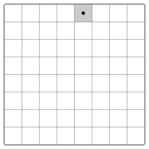

If you look in the Dialog function located at 0x401180
you will find a variable that is stored at ESP+0x10
it seems to be an int[64] type, I think this is the layout for a chess board (8 x 8 = 64)

#First your input is checked if it is less than 128 in length:

// esp + 0x110 is first arg for this function which receives the return result from GetDlgItemTextA from main function, it is the length of the input you provide
```
.text:00401006                 cmp     [esp + 0x110], 128 
.text:00401011                 push    edi
.text:00401012                 mov     edi, eax
.text:00401014                 jnb     short loc_401020
```


#Then, the algorithm below iterates through the input and maps it to the int[8][8] variable:
```
.text:00401031                 mov     al, [edi+esi*2]
.text:00401034                 mov     cl, [edi+esi*2+1]
.text:00401038                 lea     edx, [esp+118h+String]
.text:0040103C                 push    edx             ; String
.text:0040103D                 mov     [esp+11Ch+String], al
.text:00401041                 mov     byte ptr [esp+11Ch+var_10B], cl
.text:00401045                 call    ebx ; atoi
.text:00401047                 mov     ecx, esi
.text:00401049                 mov     edx, esi
.text:0040104B                 shr     ecx, 3
.text:0040104E                 and     edx, 7
.text:00401051                 add     esi, 1
.text:00401054                 add     esp, 4
.text:00401057                 cmp     esi, 40h ; '@'
.text:0040105A                 lea     ecx, [edx+ecx*8]
.text:0040105D                 mov     [esp+ecx*4+118h+var_100], eax
.text:00401061                 jl      short loc_401031
.text:00401063                 mov     eax, 64h ; 'd'
.text:00401068                 mov     [esp+118h+var_108], eax
.text:0040106C                 mov     [esp+118h+var_104], eax
.text:00401070                 xor     edx, edx
.text:00401072                 lea     esi, [esp+118h+var_100]
```

#This is a loose translation of this:
```
for (i = 0; i < 64; ++i)
  {
    String[0] = *(u8*)(b + 2 * i);
    String[1] = *(u8*)(b + 2 * i + 1);
    c = atoi(&String);
    d = i >> 3;
    e = i & 7;
    board[8 * d + e] = c;
  }
```
then there a 4 or 5 more blocks of code you have to analyse, but it does seems to indeed be the Knights Tour algorithm





Knight's Tour


you can recognise the Knight movement because of these decompiled blocks of code from 0x4010E4 - 0x40101F:

```
LABEL_20:
    v20 = v14;
    if ( v14 > v30 || (v20 = v30, v21 = v14, v14 >= v30) )
      v21 = v30;
    if ( v20 - v21 != 2 )
      goto LABEL_35;
    v22 = v15;
    if ( v15 > v31 || (v22 = v31, v23 = v15, v15 >= v31) )
      v23 = v31;
    if ( v22 - v23 != 1 )
    {
LABEL_35:
      v24 = v14;
      if ( v14 > v30 || (v24 = v30, v25 = v14, v14 >= v30) )
        v25 = v30;
      if ( v24 - v25 != 1 )
        return 0;
      v26 = v15;
      if ( v15 > v31 || (v26 = v31, v27 = v15, v15 >= v31) )
        v27 = v31;
      if ( v26 - v27 != 2 )
        return 0;
```
